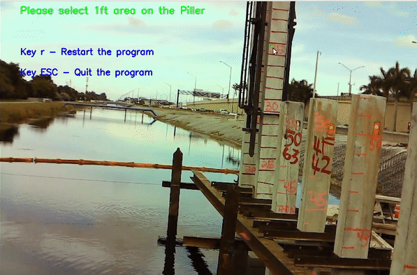

<!-- PROJECT SHIELDS -->
<!--
*** I'm using markdown "reference style" links for readability.
*** Reference links are enclosed in brackets [ ] instead of parentheses ( ).
*** See the bottom of this document for the declaration of the reference variables
*** for contributors-url, forks-url, etc. This is an optional, concise syntax you may use.
*** https://www.markdownguide.org/basic-syntax/#reference-style-links
-->
![made-with-python]
![contributors-shield]
![gitHub-release]


<!-- PROJECT LOGO -->
<br />
<p align="center">
  <a href="https://github.com/eimran-eimon/computer-vision-piller-sink/">
    
  </a>

  <h3 align="center">Smart Structure</h3>

  <p align="center">
    This project presents a smart structure solution utilizing the OpenCV library and the Python programming language.
    <br />
    <a href="https://github.com/eimran-eimon/computer-vision-piller-sink/"><strong>Explore the docs »</strong></a>
    <br />
    <br />
    <a href="https://github.com/eimran-eimon/computer-vision-piller-sink/">View Demo</a>
    ·
    <a href="https://github.com/eimran-eimon/computer-vision-piller-sink/">Report Bug</a>
    ·
    <a href="https://github.com/eimran-eimon/computer-vision-piller-sink/">Request Feature</a>
</p>


<!-- TABLE OF CONTENTS -->
<details open="open">
  <summary>Table of Contents</summary>
  <ol>
    <li>
      <a href="#about-the-project">About The Project</a>
      <ul>
        <li><a href="#built-with">Features</a></li>
      </ul>
    </li>
    <li>
      <a href="#getting-started">Getting Started</a>
      <ul>
        <li><a href="#prerequisites">Prerequisites</a></li>
        <li><a href="#installation">Installation</a></li>
      </ul>
    </li>
    <li><a href="#usage">Usage</a></li>
    <li><a href="#license">License</a></li>
    <li><a href="#contact">Contact</a></li>
    <li><a href="#acknowledgements">Acknowledgements</a></li>
  </ol>
</details>


<!-- ABOUT THE PROJECT -->
## About The Project

This project's primary purpose is to measure how much of a Piller is hammering down in real-time using the CCTV stream.


<!-- GETTING STARTED -->
## Getting Started
Please install Python and OpenCV on your local machine.

### Prerequisites

* [Python - 3.6](https://www.python.org/)
* [OpenCV - 3.4.2](https://opencv.org/release/opencv-3-4-2/)


### Installation

1. Clone the repository
   ```
   git clone https://github.com/eimran-eimon/computer-vision-piller-sink
   ```
3. Change the project directory
   ```
   cd computer-vision-piller-sink/software_1/
   ```
4. Install required Python packages (`requirements.txt`)
   ```
   pip3 install -r requirements.txt
   ```
   
5. Run the program (`main.py`)
   ```
   python3 main.py
   ```
** Please keep some sample videos in the `software_1` folder and change the `main.py` accordingly.


<!-- USAGE EXAMPLES -->
## Usage
1. Select 1ft area on the Piller.
<hr> 
    
<hr>
2. Select the Region Of Interest.
<hr> 
    
<hr>
Description and [Documentation]().


<!-- ROADMAP -->
## Roadmap

See the [open issues](https://github.com/eimran-eimon/computer-vision-piller-sink/issues) for a list of proposed features (and known issues).


<!-- CONTRIBUTING -->
## Contributing

1. Fork the Project
2. Create your Feature Branch (`git checkout -b feature/AmazingFeature`)
3. Commit your Changes (`git commit -m 'Add some AmazingFeature'`)
4. Push to the Branch (`git push origin feature/AmazingFeature`)
5. Open a Pull Request


<!-- LICENSE -->
## License
 Yet to be decided.


<!-- CONTACT -->
## Contact

`Md. Eimran Hossain Eimon` - mdeimranhossaineimon@gmail.com

`Project Link:` [https://github.com/eimran-eimon/computer-vision-piller-sink](https://github.com/eimran-eimon/computer-vision-piller-sink)


<!-- ACKNOWLEDGEMENTS -->
## Acknowledgements
* [Some Acknowledgements]()


<!-- MARKDOWN LINKS & IMAGES -->
<!-- https://www.markdownguide.org/basic-syntax/#reference-style-links -->
[contributors-shield]: https://img.shields.io/badge/Contributor-Eimran_Eimon-<COLOR>.svg
[made-with-python]: http://ForTheBadge.com/images/badges/made-with-python.svg
[gitHub-release]: https://img.shields.io/badge/Release-Software_I-blue.svg
[product-screenshot]: images/screenshot.png